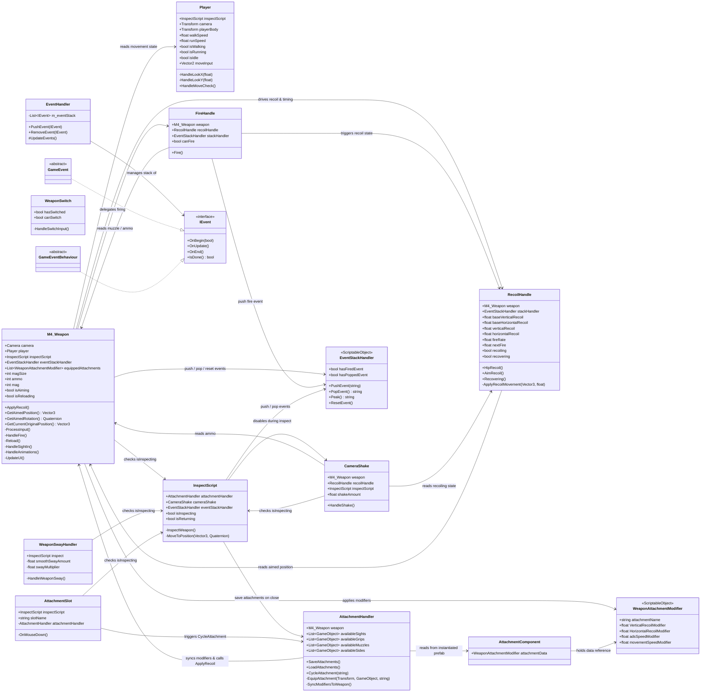

# AdvancedWeapon — Unity FPS Weapon System

A modular weapon system built in Unity featuring weapon firing, recoil, attachment customization, inspection, camera shake, and an event-driven architecture.

---

## Architecture Overview



---

## Module Breakdown

| Module | Classes | Responsibility |
|---|---|---|
| **Player** | `Player` | Input handling, camera look, movement state |
| **Weapon Core** | `M4_Weapon` | Central weapon controller — firing, aiming, reload, animation, UI |
| **Weapon Handlers** | `FireHandle`, `RecoilHandle` | Firing logic / VFX spawning, recoil movement & recovery |
| **Weapon Effects** | `WeaponSwayHandler`, `CameraShake` | Mouse-driven weapon sway, screen shake on fire |
| **Weapon Switching** | `WeaponSwitch` | Toggle active weapon via input |
| **Attachments** | `AttachmentHandler`, `AttachmentSlot`, `AttachmentComponent`, `WeaponAttachmentModifier` | Runtime attachment cycling, modifier data, recoil sync |
| **Inspection** | `InspectScript` | Enter/exit inspect mode, save attachments, cursor control |
| **Event System** | `EventHandler`, `EventStackHandler`, `IEvent`, `GameEvent`, `GameEventBehaviour` | Stack-based event management and logging |

---

## Data Flow

```
Player Input
    |
    |--> Player -> movement state -> M4_Weapon (walk/run animation)
    |
    |--> M4_Weapon
    |       -> Fire -> FireHandle -> RecoilHandle (recoil)
    |       |                |-> CameraShake (screen shake)
    |       -> Aim  -> sight-in coroutine
    |       -> Reload -> magazine detach/reattach coroutine
    |
    |--> InspectScript
    |       -> Enter -> disable CameraShake, push event, unlock cursor
    |       -> Exit  -> AttachmentHandler.SaveAttachments(), pop event
    |
    |--> AttachmentSlot.OnMouseDown()
            -> AttachmentHandler.CycleAttachment()
                    -> SyncModifiersToWeapon() -> M4_Weapon.ApplyRecoil()
```
